# 白蛇传数字人文研究助手

基于大语言模型 Agent 的数字人文研究助手：以《白蛇传》历代文献为语料，Agent 自主理解研究意图、规划步骤并调用工具完成检索、标注、分析与综述，提供文献阅读、智能问答、原文标注、母题演化分析、跨版本对比与研究报告生成等功能。

## 功能

- **Agent 自主研究**：LangGraph 调度问答、标注、演化、对比等研究工作流，ReAct 循环自主调用数十个工具，执行过程透明可追溯
- **文献阅读**：按章节阅读《白蛇传文献选集》，段落级展示，支持目录跳转
- **全文搜索**：在主文献中关键词检索，按相关度排序，高亮命中位置
- **AI 智能对话**：基于文献语料的问答，回答附原文引用，可点击跳转高亮
- **智能标注**：AI 自动识别人物、地点、情节、母题等实体并高亮，支持用户手动增删与旁注
- **母题演化**：跨版本追踪同一母题在不同文献中的形态演变
- **跨版本对比**：两个版本 / 段落并排对照，自动识别差异
- **朝代对比**：各时期人物、地点、情节元素的统计与对比
- **文献地图**：故事地点地图可视化
- **可视化图表**：堆叠柱状图、桑基图、旭日图、热力图、力导向关系图等
- **报告库**：AI 生成的研究报告集中保存、回看与导出
- **用户系统**：注册登录，数据按用户隔离

## 界面演示

部分功能截图，完整录屏（4 分 11 秒，约 9 MB）见 [demo.mp4](assets/demo/demo.mp4)。

**主界面**

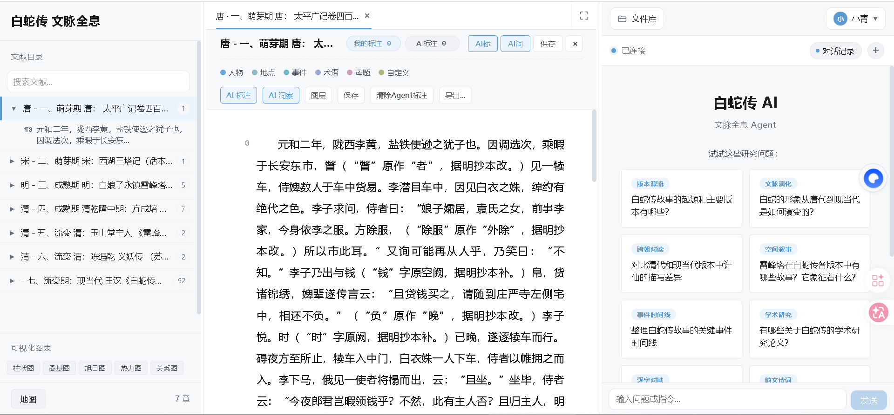

主界面：左侧文献目录、右侧 AI Agent 对话，中间多标签工作区承载阅读、检索、对比、地图、报告等全部功能页面。

**全文搜索**

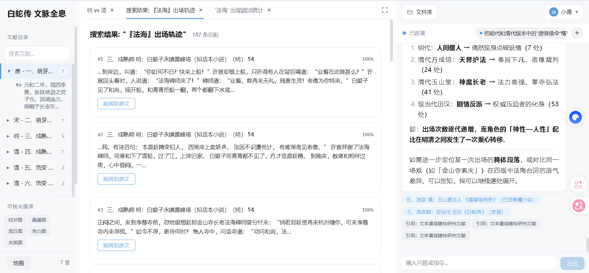

全文搜索：关键词全文匹配并高亮命中位置，按命中频次归一化的相关度排序展示。

**AI 问答**


AI 问答：实时展示意图识别、关键词抽取与 ReAct 检索过程，回答附引用可追溯。

**工具调用**

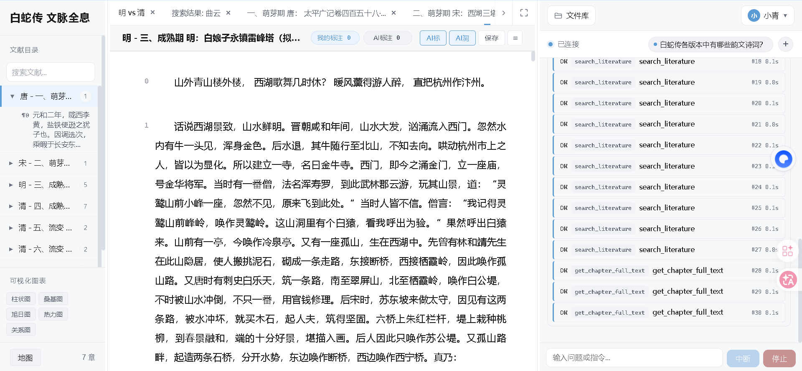

工具调用：检索、取章等工具调用逐条记录结果与耗时，执行轨迹全程透明。

**智能标注**

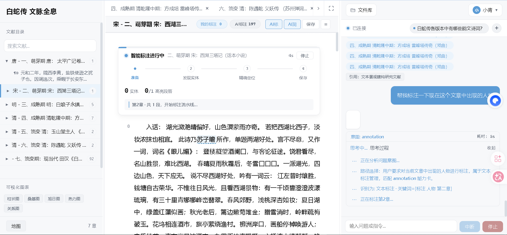

智能标注：AI 标注分步推进，实时显示实体数与当前阶段，可随时停止。

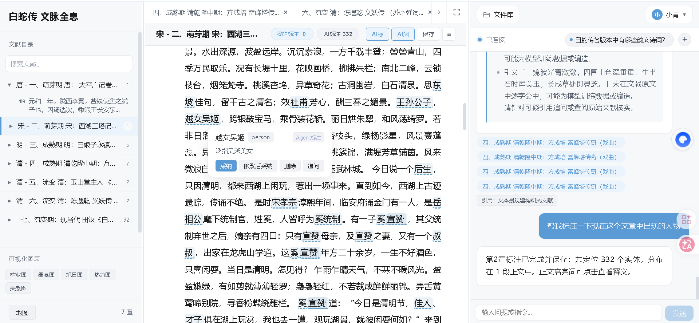

标注结果：全章自动定位 332 个实体并分类高亮，点击可看释义，支持采纳 / 修改 / 删除 / 追问。

**跨版本对比**

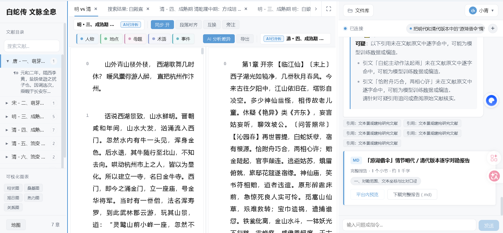

跨版本对比：两个朝代版本并排对勘，AI 逐字比对差异并生成可导出的对勘报告。

**文献地图**

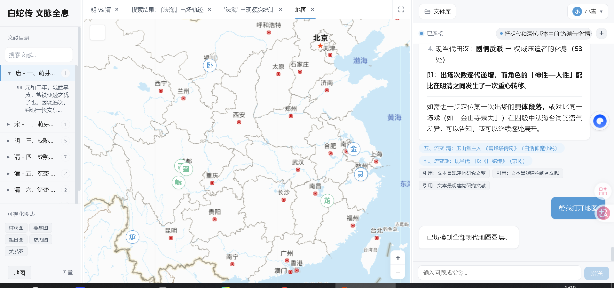

文献地图：故事地点标注在地图上，按图例区分类型，支持切换朝代图层。

**报告库**


报告库：AI 生成的长报告集中保存，可平台内预览、跳转章节并下载完整 Markdown。

**演化分析**

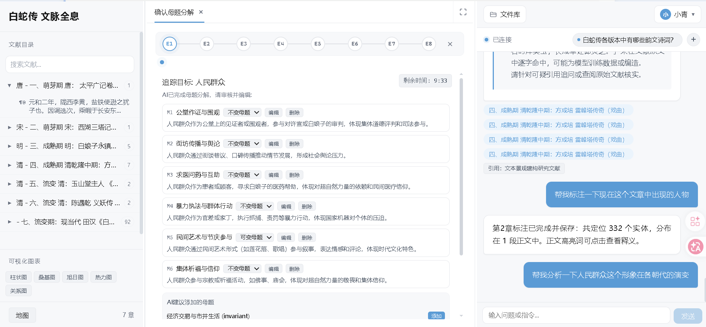

确认母题分解：AI 围绕分析目标拆解出 6 个母题并区分不变题 / 可变题，可编辑增删或采纳 AI 建议。

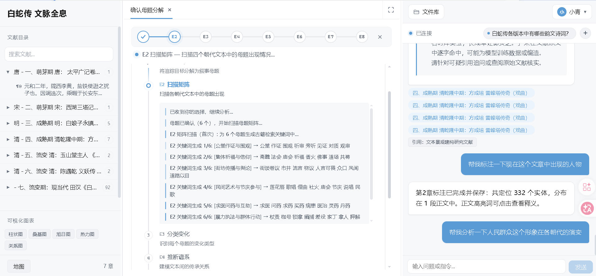

扫描矩阵：逐朝代逐母题扫描出现情况，实时展示每格的检索关键词与扫描进度。

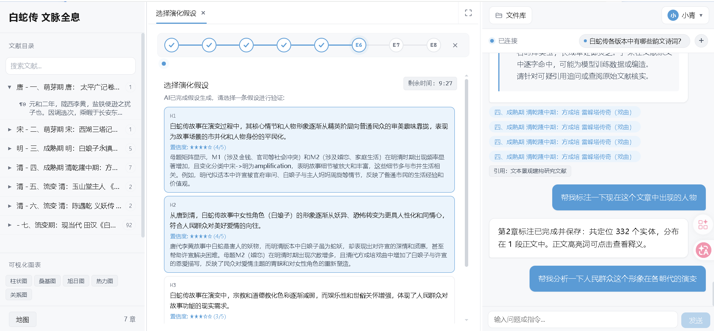

选择演化假设：给出三条候选假设并附证据数与量化评分，选定后进入验证。

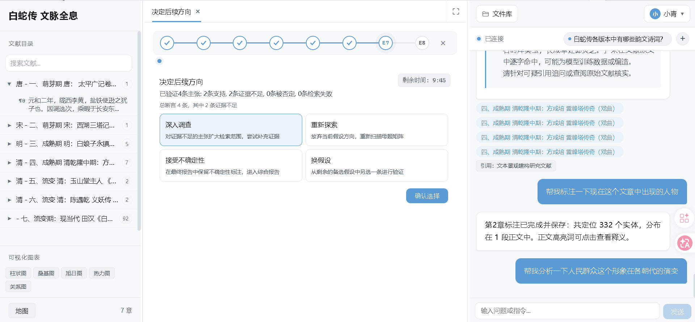

决定后续方向：按验证结果提供深入调查 / 重新探索 / 接受不确定性 / 换假设四种走向。

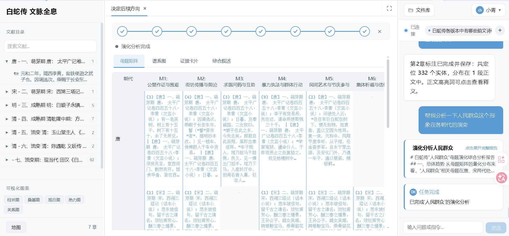

母题矩阵：朝代 × 母题的证据网格，每格附原文摘录，一屏纵览母题形态演变。

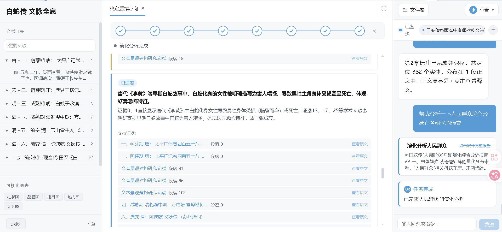

证据卡片：每条实证结论均列出支持证据与参考证据（含章节出处），可逐一查看原文。

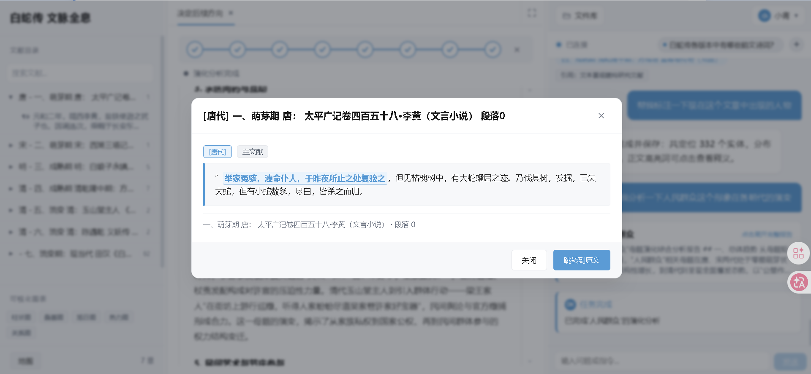

引文跳转原文：点击证据弹出引言并高亮，一键跳转到文献原文定位核验。

## 技术栈

| 层 | 技术 |
|----|------|
| 前端 | Vue 3、Vite、TypeScript、Pinia、Leaflet、ECharts |
| 业务后端 | Node.js、Fastify、SQLite |
| AI Agent | Python、FastAPI、LangGraph、ChromaDB、sentence-transformers |

## 快速开始

```bash
# 前端
cd client && npm install

# 业务后端
cd ../server && npm install

# AI Agent
cd ../agent
python -m venv venv
# Windows: venv\Scripts\activate    Linux/macOS: source venv/bin/activate
pip install -r requirements.txt
```

配置 LLM API Key（从模板复制后填入）：

```bash
cp .env.example .env
cp agent/.env.example agent/.env
```

启动（三个终端）：

```bash
# AI Agent
cd agent && uvicorn server.main:app --reload --port 8000

# 业务后端
cd server && npm run dev

# 前端
cd client && npm run dev
```

浏览器打开 http://localhost:5173 。首次启动 Agent 会自动下载 embedding 模型，并需运行索引构建生成向量库。

## 语料数据

仓库已包含主文献《白蛇传文献选集》（公版古籍汇编），可直接用于阅读、搜索、标注与 AI 问答。

以下数据未随仓库发布：

| 数据 | 用途 | 缺失影响 |
|------|------|----------|
| 文本景观建构研究文献 | 研究文献阅读与 RAG 增强 | 研究文献页面不可用，AI 问答仅基于主文献 |
| 各地点分词结果（.xlsx） | 地图地点数据与可视化图表 | 地图无地点标记，相关图表无数据 |

即：克隆仓库后，文献阅读、搜索、AI 问答、标注、演化分析、对比、报告等核心功能可直接运行；地图与部分图表需补充地点分词数据后才有内容。

## 说明

- 项目持续迭代中；
- 主文献为公版古籍；未包含的研究文献版权归原作者所有；
- AI 相关功能需自备 LLM API Key，费用自理。

## 许可

仅供学习与学术研究使用。
